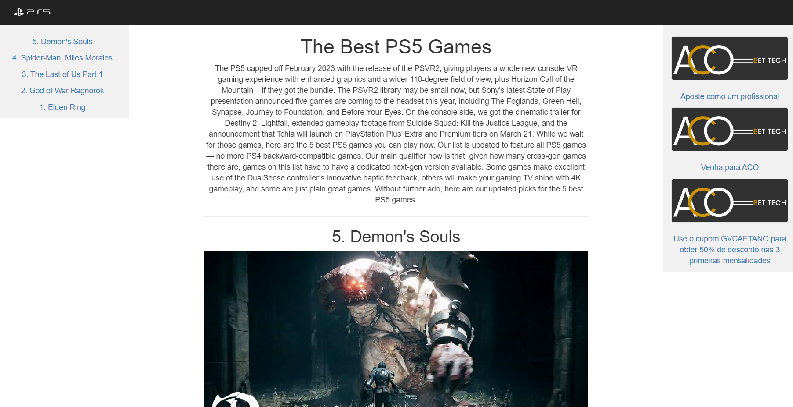

# Top 5 melhores jogos de ps5 de 2023

.

[Site publicado](https://elc1090.github.io/project1-gabriel-caetano/)

#### Desenvolvedor(a)
Gabriel Vinicius Schmitt Caetano

#### Cliente
Daniel dos Santos

#### Tecnologias

tecnologias usadas:
- HTML
- CSS
- Bootstrap

#### Ambiente de desenvolvimento

ferramentas de desenvolvimento usadas:
- VS Code
- Live Server (extensão)

#### Créditos

Preencha aqui uma lista detalhada de recursos aproveitados no projeto, por exemplo:
- [template usado](https://www.w3schools.com/bootstrap/tryit.asp?filename=trybs_temp_webpage&stacked=h)
- [Lista de jogos e conteúdos](https://www.ign.com/articles/the-best-ps5-games)

#### Bastidores

Cliente interessado no mundo dos jogos, buscando uma forma de concentrar os melhores jogos da sua plataforma preferida.Desenvolvimento simples feito com as tecnologias mais básicas disponíveis, apenas com uso de um template e bootstrap para agilizar o processo, segundo o cliente atendeu as necessidades perfeitamente, apesar de não ter feito o pagamento do serviço.

---
Projeto entregue para a disciplina de [Desenvolvimento de Software para a Web](http://github.com/andreainfufsm/elc1090-2023a) em 2023a